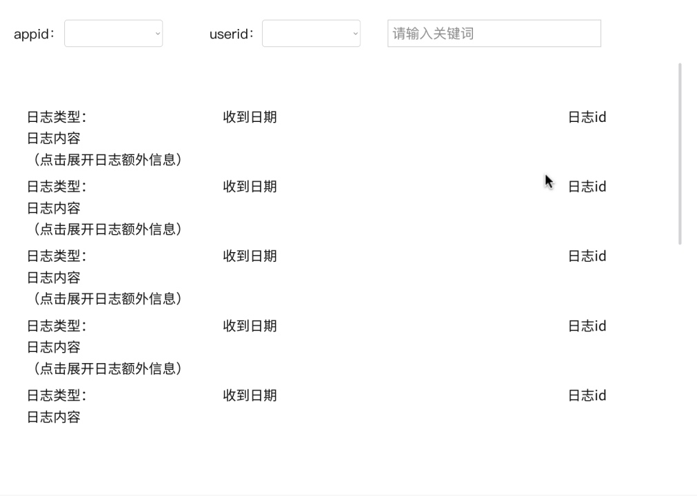
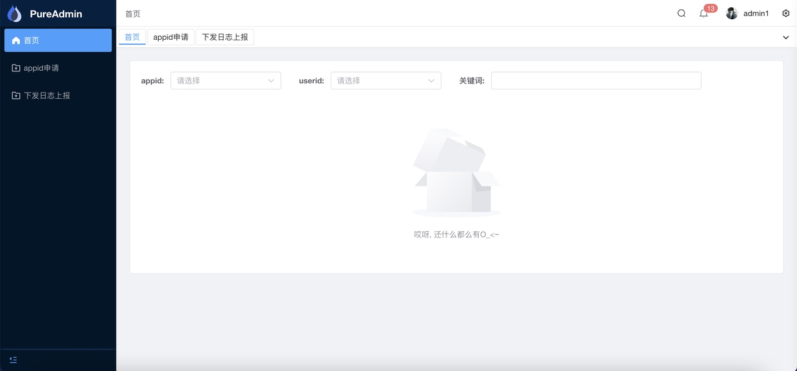
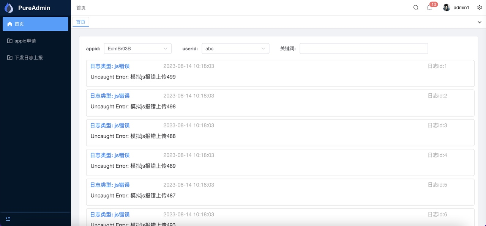
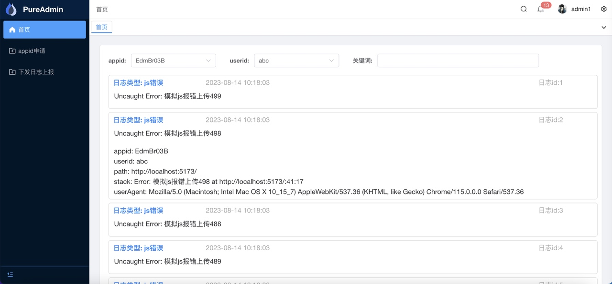
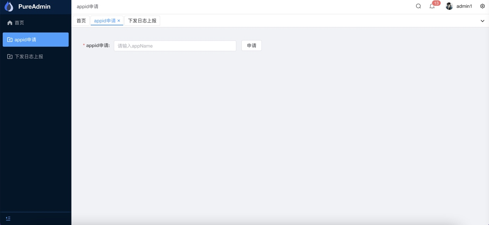
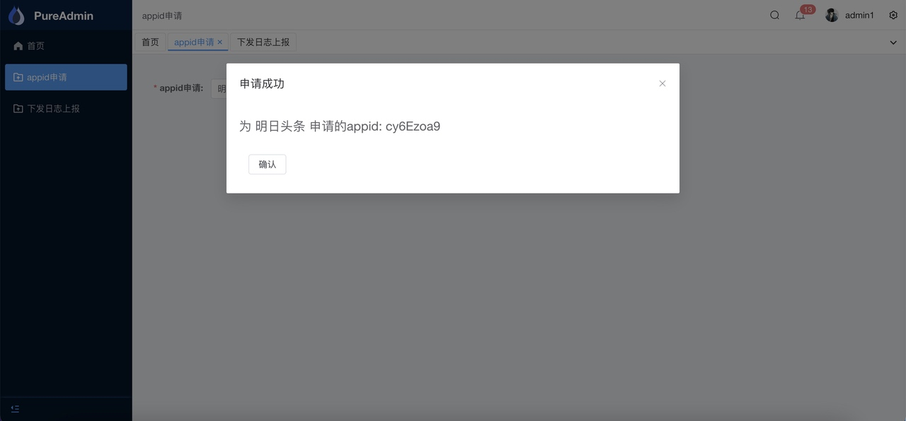
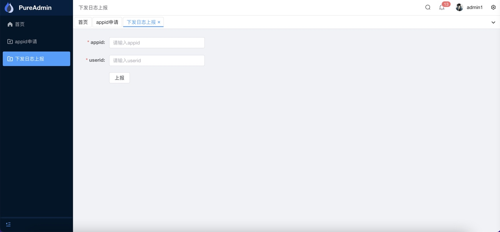

# 日志管理系统管理端部分
### 项目需求分析
1. 输入用户名和密码进行登陆
2. 管理员填写应用名并申请appid
3. 当用户联系到我们，我们需要将日志上报的流程推送到用户的应用上，在通过userid校验后允许用户上传日志。
4. 对用户上传的日志进行解析与展示，并实现简单的关键字检索（支持模糊匹配）

### 技术方案
管理系统使用vue-pure-admin模版，在模版的基础上修改。
项目原型图：

### 项目展示
登陆界面

首页
无数据状态

有数据状态

点击每一行会展开额外信息：

查询功能
输入关键字进行大小写不敏感的日志信息匹配
appid申请页面

规定appName输入长度在4-50之间

申请成功会返回appid

下发日志上报页面

如果appid不存在会弹出错误信息

